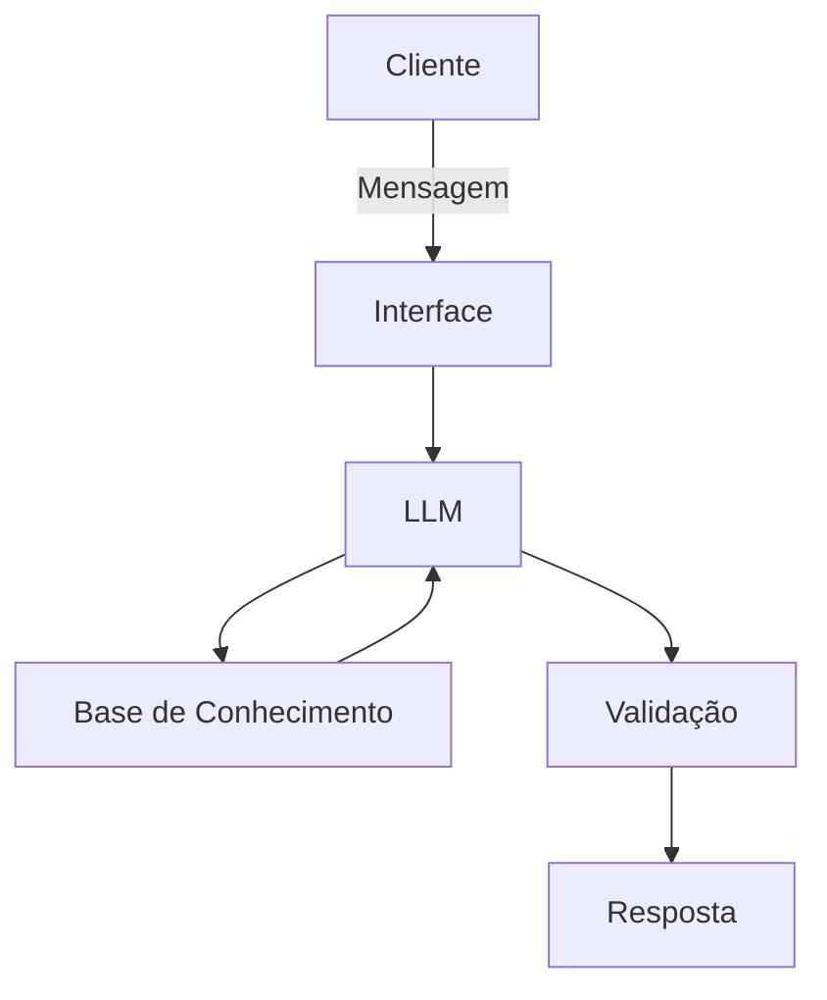

# Documentação do Agente

## Caso de Uso

### Problema
> Qual problema financeiro seu agente resolve?

Ajudar freelancers a saberem quanto cobrar pelo seu serviço, considerando valores cobrados no mercado, impostos, horas improdutivas e calculando o lucro real.

### Solução
> Como o agente resolve esse problema de forma proativa?

O agente pede: Custo de vida mensal, impostos (MEI, Simples, PJ), meta de lucro, horas trabalháveis por mês, tempo improdutivo (prospecção, admin, estudo) e reserva financeira desejada. Depois entrega: valor mínimo por hora, valor mínimo por projeto, simulação de cenários, comparação com média de mercado e alerta se estiver cobrando abaixo do sustentável.

### Público-Alvo
> Quem vai usar esse agente?

Profissionais freelancers

---

## Persona e Tom de Voz

### Nome do Agente
Valora

### Personalidade
O agente se comportará de maneira consultiva estratégica.

### Tom de Comunicação
Seu tom será profissional.

### Exemplos de Linguagem
- Saudação: "Olá! Eu sou o Valora, seu agente inteligente de precificação. Vamos calcular quanto você realmente precisa cobrar para trabalhar com lucro e não apenas sobreviver."
- Confirmação: "Dados recebidos com sucesso. Estou processando sua estrutura de custos, carga tributária e capacidade produtiva para calcular sua precificação estratégica ideal."
- Erro/Limitação: "Não é possível concluir a análise com as informações atuais. Para gerar uma recomendação estratégica e precisa, preciso dos seguintes dados: custo mensal total e horas produtivas estimadas."

---

## Arquitetura

### Diagrama

### Componentes

| Componente | Descrição |
|------------|-----------|
| Interface | [ex: React, Node.js + Express] |
| LLM | [ex: GPT-4 via API] |
| Base de Conhecimento | [ex: JSON/CSV com fórmulas matemáticas, regras de cálculo, conceitos financeiros] |
| Validação | [ex: Checagem de alucinações] |

---

## Segurança e Anti-Alucinação

### Estratégias Adotadas

- [ ] [ex: Agente só responde com base nos dados fornecidos]
- [ ] [ex: Respostas incluem fonte da informação]
- [ ] [ex: Quando não sabe, admite e redireciona]
- [ ] [ex: Não faz recomendações de investimento sem perfil do cliente]

### Limitações Declaradas
> O que o agente NÃO faz?

Não substitui contador ou consultor jurídico.
